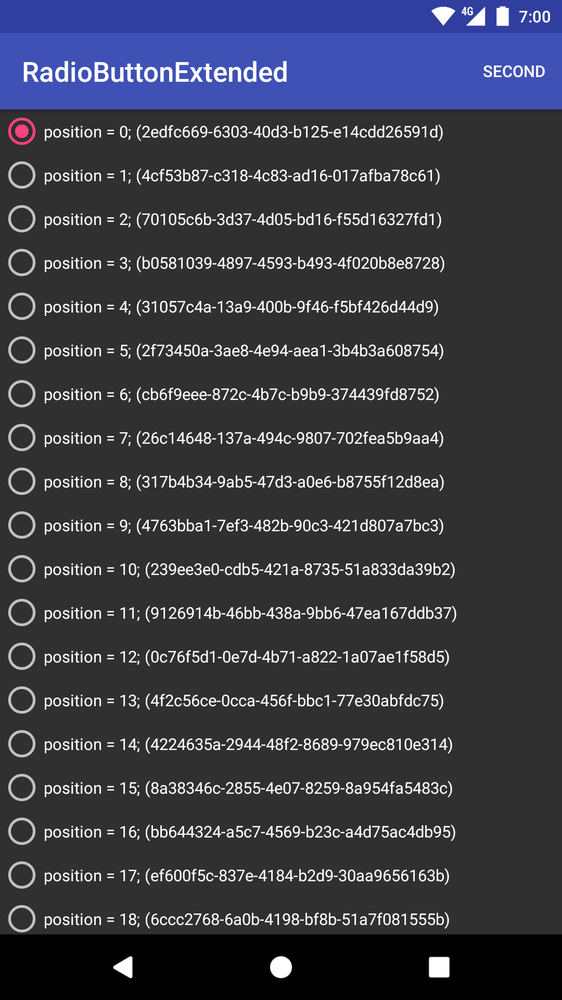
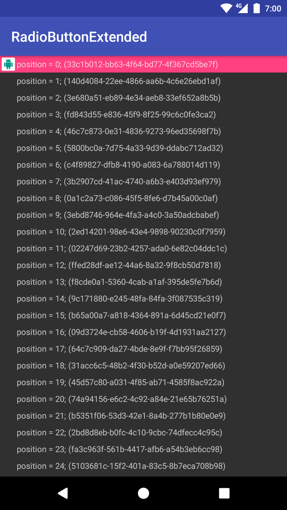

# android-radiobutton-extended

<a href='https://play.google.com/store/apps/details?id=jp.s64.android.radiobuttonextended.example&pcampaignid=MKT-Other-global-all-co-prtnr-py-PartBadge-Mar2515-1'></a>

An example project / library of custom RadioButton widgets.

 

This is contains below components:

- CompoundFrameLayout
- RadioFrameLayout
- RadioGroupedAdapter

## Usages

Add following lines to your buildscripts.

```groovy
buildscript {
    ext {
        radiobutton_extended_version = '0.1.0'
    }
}
```

```groovy
repositories {
    maven {
        url "http://dl.bintray.com/s64/maven"
    }
}

dependencies {
    compile("jp.s64.android.radiobuttonextended:core:${radiobutton_extended_version}") {
        exclude module: 'support-annotations'
    }
    
    compile("jp.s64.android.radiobuttonextended:recycler:${radiobutton_extended_version}") {
        exclude module: 'support-annotations'
        exclude module: 'recyclerview-v7'
    }
}
```
